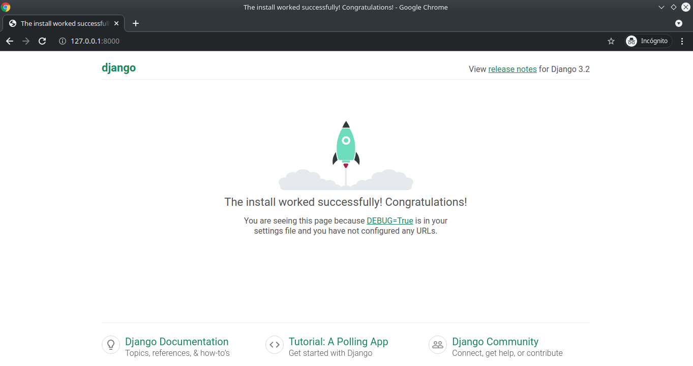
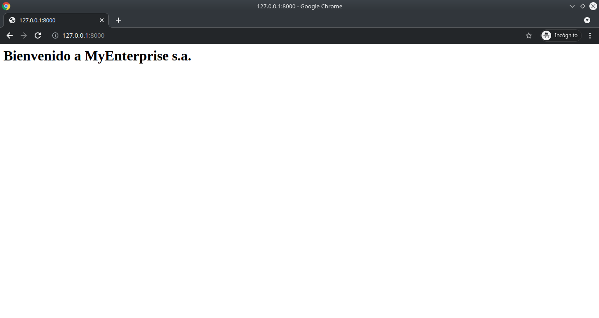

# Guía para creación de proyecto en Django

El presente documento servirá como una guía rápida para la creación de proyectos utilizando el framework Django utilizando sus elementos básicos del mismo.
Instalación probada sobre entorno Ubuntu 20.04, python 3.8.8 y Django 3.2.4

La estructura de esta guía se presenta a continuación:

<div id="indice" />

**Índice**
1. [Creación de un entorno virtual](#paso1)
2. [Instalación de Django sobre entorno virtual](#paso2)
3. [Creación de un nuevo proyecto](#paso3)
4. [Estructura de archivos](#paso4)
5. [Migración inicial](#paso5)
6. [Creación de vistas y enrutamiento](#paso6)
7. [Creación de aplicaciones](#paso7)
8. [Estructura de archivos de aplicaciones](#paso8)
9. [Vistas y enrutamiento en aplicaciones](#paso9)
10. [Plantillas](#paso10)
11. [Archivos estáticos](#paso11)
12. [GET y POST request](#paso12)
13. [Redireccionamiento](#paso13)
14. [Sesiones](#paso14)


<div id='paso1' />

## 1. Creación de un entorno virtual

En la carpeta donde se desee crear el nuevo entorno virtual

```bash
$ python -m venv DjangoVenv
```

Esto creará un entorno virtual en la carpeta actual

```bash
$ ls
DjangoVenv/
```

Activación del entorno virtual

```bash
$ source DjangoVenv/bin/activate
(DjangoVenv) $ 
```

[Volver al índice](#indice)

<div id='paso2' />

## 2. Instalación de Django sobre entorno virtual

```bash
(DjangoVenv)$ pip install Django
```

[Volver al índice](#indice)

<div id='paso3' />

## 3. Creación de un nuevo proyecto

En la carpeta donde se desee crear el nuevo proyecto

```bash
(DjangoVenv)$ django-admin startproject MyEnterprise
```

Entrar a la carpeta del proyecto e iniciar projecto usando archivo *manage.py*

```bash
(DjangoVenv)$ cd MyEnterprise/
(DjangoVenv)$ python manage.py runserver
Watching for file changes with StatReloader
Performing system checks...

System check identified no issues (0 silenced).

You have 18 unapplied migration(s). Your project may not work properly until you apply the migrations for app(s): admin, auth, contenttypes, sessions.
Run 'python manage.py migrate' to apply them.
June 17, 2021 - 05:36:41
Django version 3.2.4, using settings 'MyEnterprise.settings'
Starting development server at http://127.0.0.1:8000/
Quit the server with CONTROL-C.
```

Ingresamos a la url http://127.0.0.1:8000/ indicada para verificar el correcto funcionamiento del servidor



[Volver al índice](#indice)

<div id='paso4' />

## 4. Estructura de archivos

Al crear el nuevo proyecto Django, se crea la siguiente estructura de archivos y carpetas:

```
MyEnterprise/
│   manage.py
│   db.sqlite3    
│
└───MyEnterprise/
│   │   __init__.py
│   │   asgi.py
│   │   settings.py
│   │   urls.py
│   │   wsgi.py
```

**manage.py** : Script usado para crear aplicaciones, trabajar con base de datos e iniciar pruebas de desarrollo levantando servidor de pruebas.

**db.sqlite3**: Base de datos por omisión.

**\_\_init\_\_.py**: Archivo encargado de indicar que el presente directorio es un **paquete python** (archivo vacío)

**settings.py**: Archivo que almacena la información sobre las plantillas y base de datos. Debe ser modificado cada vez que se agrega una nueva aplicación.

**urls.py**: Script encargado de manejar las urls de nuestro sitio web.

**wsgi.py y asgi.py**: Archivos que operan como interfaces para subir nuestro proyecto a un servidor Web.


*Ref: Explicación basada en los sitios web https://developer.mozilla.org/es/docs/Learn/Server-side/Django/skeleton_website y https://www.askpython.com/django/django-app-structure-project-structure*


[Volver al índice](#indice)

<div id='paso5' />

## 5. Migración inicial

Django provee todos sus proyectos con algunas aplicaciones preinstaladas (ej. admin, auth, etc.). Estas aplicaciones, vienen con sus propios modelos, los cuales serán migrados a nuestra base de datos durante nuestra primera migración.

```bash
(DjangoVenv)$ python manage.py migrate
Operations to perform:
  Apply all migrations: admin, auth, contenttypes, sessions
Running migrations:
  Applying contenttypes.0001_initial... OK
  Applying auth.0001_initial... OK
  Applying admin.0001_initial... OK
  Applying admin.0002_logentry_remove_auto_add... OK
  Applying admin.0003_logentry_add_action_flag_choices... OK
  Applying contenttypes.0002_remove_content_type_name... OK
  Applying auth.0002_alter_permission_name_max_length... OK
  Applying auth.0003_alter_user_email_max_length... OK
  Applying auth.0004_alter_user_username_opts... OK
  Applying auth.0005_alter_user_last_login_null... OK
  Applying auth.0006_require_contenttypes_0002... OK
  Applying auth.0007_alter_validators_add_error_messages... OK
  Applying auth.0008_alter_user_username_max_length... OK
  Applying auth.0009_alter_user_last_name_max_length... OK
  Applying auth.0010_alter_group_name_max_length... OK
  Applying auth.0011_update_proxy_permissions... OK
  Applying auth.0012_alter_user_first_name_max_length... OK
  Applying sessions.0001_initial... OK
```

[Volver al índice](#indice)

<div id='paso6' />

## 6. Creación de vistas y enrutamiento

Dentro de nuestro proyecto, en la carpeta *MyEnterprise/MyEnterprise/*, agregar el archivo *views.py*. Este definirá las vistas de nuestro proyecto.

```bash
(DjangoVenv)$ cd MyEnterprise/
(DjangoVenv)$ touch views.py
```

Dentro de *views.py* crearemos las funciones encargadas de cada una de las vistas

```python
# MyEnterprise/views.py

from django.shortcuts import HttpResponse

# Funciones para el manejo de vistas

def index(request):
    return HttpResponse('<h1>Bienvenido a MyEnterprise s.a.</h1>')
```

Esta vista será asociada a una url en el proyecto. Para esto, modificaremos el archivo *urls.py*.

```python
# MyEnterprise/urls.py

from django.contrib import admin
from django.urls import path
from MyEnterprise import views # Import agregado

urlpatterns = [
    path('admin/', admin.site.urls),
    path('', views.index), # Path agregado
]
```

Ejecutamos nuevamente nuestro servidor para verificar que la nueva vista ha sido agregada

```bash
(DjangoVenv)$ python manage.py runserver
```



[Volver al índice](#indice)

<div id='paso7' />

## 7. Creación de aplicaciones

Nuestro proyecto puede contar con una o más aplicaciones. Para crear una nueva aplicación, tenemos que ejecutar el script *manage.py* como se muestra a continuación

```bash
(DjangoVenv)$ python manage.py startapp App1
```

Luego, debemos *instalar* la aplicación en nuestro proyecto. Para ello, modificaremos el script *settings.py* de nuestro proyecto para agregar la nueva aplicación a nuestro proyecto

```python
# MyEnterprise/settings.py

...

# Application definition
INSTALLED_APPS = [
    'App1', # Se agrega la App1 a nuestras aplicaciones instaladas
    'django.contrib.admin',
    'django.contrib.auth',
    'django.contrib.contenttypes',
    'django.contrib.sessions',
    'django.contrib.messages',
    'django.contrib.staticfiles',
]

...

```

[Volver al índice](#indice)

<div id='paso8' />

## 8. Estructura de archivos de aplicaciones

Al crear una nueva aplicación Django, se actuliza la estructura de archivos y carpetas de nuestro proyecto de la siguiente manera:

```
MyEnterprise/
│   manage.py
│   db.sqlite3    
│
└───MyEnterprise/
│   │   __init__.py
│   │   asgi.py
│   │   settings.py
│   │   urls.py
│   │   views.py
│   │   wsgi.py
│   │
└───App1/
│   └───migrations/
│   │   __init__.py
│   │   admin.py
│   │   apps.py
│   │   models.py
│   │   tests.py
│   │   views.py
```

**\_\_init\_\_.py**: Archivo solo presente para indicar que el directorio es un paquete python.

**admin.py**: Archivo encargado de registrar los modelos que creemos en nuestro administrador de Django.

**apps.py**: Archivo encargado de la configuración de la aplicación.

**models.py**: Script que contiene el modelo de nuestra aplicación.

**tests.py**: Archivo que contiene los casos de prueba de nuestro sitio.

**views.py**: Script que contiene todas las funciones asociadas con las vistas de nuestra aplicación.

[Volver al índice](#indice)

<div id='paso9' />

## 9. Vistas y enrutamiento en aplicaciones

Editaremos el archivo de *views.py* de nuestra aplicación *App1/* para agregar una nueva vista.

```python
# App1/views.py
from django.shortcuts import render, HttpResponse

# Create your views here.
def index(request):
  return HttpResponse("<h1> Bienvenido a la primera aplicación de MyEnterprise</h1>")
```

Luego, en la carpeta de nuestra aplicación *App1/*, crearemos un archivo *urls.py* y luego lo modificaremos para asociar la vista con su respectiva url *dentro de la aplicación*.

```bash
(DjangoVenv)$ cd App1/
(DjangoVenv)$ touch urls.py
```

```python
# App1/urls.py
from django.urls import path
from App1 import views

urlpatterns = [
    path('',views.index),
]

```

Luego, debemos agregar en nuestro proyecto las urls definidas dentro de nuestra aplicación. Para esto, modificaremos el archivo *urls.py* de nuestro proyecto.

```bash
(DjangoVenv)$ cd MyEnterprise/
```

```python
# MyEnterprise/urls.py
from django.contrib import admin
from django.urls import path, include # include agregado 
from MyEnterprise import views

urlpatterns = [
    path('admin/', admin.site.urls),
    path('', views.index),
    path('app1/', include('App1.urls')), # Agregamos las urls de App1 a la url raíz app1/
]
```

[Volver al índice](#indice)

<div id='paso10' />

## 10. Plantillas y paso de datos

Django permite utilizar plantillas .html creadas por el desarrollador al momento de renderizar la vista. Estas plantillas deben encontrarse dentro de una carpeta *templates/*. Crearemos esta carpeta dentro de nuestra aplicación con una primera plantilla html.

```bash
(DjangoVenv)$ cd App1/
(DjangoVenv)$ mkdir templates/
(DjangoVenv)$ touch templates/index.html
```

```html
<!--App1/templates/index.html-->
<!DOCTYPE html>
<html lang="en">
  <head>
    <meta charset="UTF-8" />
    <meta http-equiv="X-UA-Compatible" content="IE=edge" />
    <meta name="viewport" content="width=device-width, initial-scale=1.0" />
    <title>Bienvenido a App1</title>
  </head>
  <body>
    <h1>Bienvenido a App1: Una aplicación de My Enterprise</h1>
  </body>
</html>
```

Luego, la plantilla debe ser utilizada en una vista. Esta vista debe *renderizar* la plantilla. Modificaremos el archivo *views.py* de nuestra aplicación para agregar la plantilla a la vista. 

```python
# App1/views.py
from django.shortcuts import render, HttpResponse

# Create your views here.
def index(request):
  return render(request, "index.html") # Utilizamos la función render
```

Para pasar datos a una plantilla, debemos crear una variable de contexto. Esta variable es un diccionario python que contiene la información a ser pasada a la plantilla. Modificaremos nuestra vista para entregarle algunos parámetros

```python
# App1/views.py
from django.shortcuts import render, HttpResponse

# Create your views here.
def index(request):
  # Creamos un diccionario de contexto
  context = {
    'nombre': 'Optimus Prime',
    'pos_cargo': 1,
    'amigos': ['Bumblebee', 'Ratchet', 'Ironhide']
  }
  return render(request, "index.html", context) # Entregamos el contexto a nuestra plantilla
```

A continuación, modificaremos nuestra plantilla para recibir los parámetros enviados a través de nuestro contexto.

```html
<!--App1/templates/index.html-->
<!DOCTYPE html>
<html lang="en">
  <head>
    <meta charset="UTF-8" />
    <meta http-equiv="X-UA-Compatible" content="IE=edge" />
    <meta name="viewport" content="width=device-width, initial-scale=1.0" />
    <title>Bienvenido a App1</title>
    
    <link rel="stylesheet" href="">
  </head>
  <body>
    <h1>Bienvenido a App1: Una aplicación de My Enterprise</h1>
    <p>Nombre: {{nombre}}</p>
    <p>Posición del cargo {{pos_cargo}}</p>
    <p>Amigos</p>
    <ul>
    
        <li>{{amigo}}</li>
    
    </ul>
  </body>
</html>


```

[Volver al índice](#indice)

<div id='paso11' />

## 11. Archivos estáticos

Django permite agregar archivos estáticos (css, javascripts, imágenes, etc.) con una organización similar a las plantillas. Estos archivos deben encontrarse en una carpeta llamada *static/* dentro de nuestra aplicación. Dentro de esta carpeta *static/*, agregaremos las carpetas *css/*, *js/* e *images/* asociados a los archivos css, javascript e imágenes respectivament.

```bash
(DjangoVenv)$ cd App1/
(DjangoVenv)$ mkdir static/
(DjangoVenv)$ mkdir static/css/
(DjangoVenv)$ mkdir static/js/
(DjangoVenv)$ mkdir static/images/
```

Crearemos un archivo de estilo en nuestra carpeta *static/css/*

```bash
(DjangoVenv)$ touch static/css/estilo.css
```

```css
/* static/css/estilo.css */
h1 {
  border: 2px solid red;
  background-color: green;
}
```

Modificaremos nuestra plantilla para agregar el estilo creado
```html
<!--App1/templates/index.html-->
<!DOCTYPE html>
<html lang="en">
  <head>
    <meta charset="UTF-8" />
    <meta http-equiv="X-UA-Compatible" content="IE=edge" />
    <meta name="viewport" content="width=device-width, initial-scale=1.0" />
    <title>Bienvenido a App1</title>
    
    <link rel="stylesheet" href="">
  </head>
  <body>
    <h1>Bienvenido a App1: Una aplicación de My Enterprise</h1>
  </body>
</html>
```

[Volver al índice](#indice)

<div id='paso12' />

## 12. GET y POST request

Crearemos una nueva vista que reciba request *GET* y *POST*. Para ello, utilizaremos el parámetro de entrada de nuestra vista *request*. Utilizando esta variable, podremos determinar qué tipo de solicitud ha sido enviada y cuales son los datos enviados en dicha solicitud.
Modificaremos el archivo *views.py* de nuestra aplicación para la creación de la nueva vista de solicitudes y para una vista adicional para un formulario que genere solicitudes de tipo *POST*.

```python
# App1/views.py
from django.shortcuts import render, redirect

# Create your views here.

def index(request):
    context = {
        'nombre': 'Optimus Prime',
        'pos_cargo': 1,
        'amigos': ['Bumblebee', 'Ratchet', 'Ironhide']
    }
    return render(request, 'index.html', context)


def solicitudes(request): # Vista que detecta solicitudes GET y POST
    context = {}
    if request.method == "GET":
        print("Se detectó una solicitud GET")
        print(request.GET)
        context['solicitud'] = 'GET'
    elif request.method == "POST":
        print("Se detectó una solicitud POST")
        print(request.POST)
        context['solicitud'] = 'POST'
    return render(request,"solicitudes.html", context)

def form(request): # Vista para formulario que genera solicitudes POST
    return render(request,"form.html")
```

Para cada una de estas vistas, crearemos una plantilla

```html
<!--App1/templates/solicitudes.html-->
<!DOCTYPE html>
<html lang="en">
<head>
    <meta charset="UTF-8">
    <meta http-equiv="X-UA-Compatible" content="IE=edge">
    <meta name="viewport" content="width=device-width, initial-scale=1.0">
    <title>Solicitud App1</title>
</head>
<body>
    <h1>La solicitud recibida es de tipo {{solicitud}}</h1>
</body>
</html>
```

**Ojo:** En el formulario de envío de solicitudes tipo *POST*, es necesario agregar el token CSRF. Esto se usa para evitar falsificaciones en el envío de datos de formularios.

```html
<!--App1/templates/form.html-->
<!DOCTYPE html>
<html lang="en">
<head>
    <meta charset="UTF-8">
    <meta http-equiv="X-UA-Compatible" content="IE=edge">
    <meta name="viewport" content="width=device-width, initial-scale=1.0">
    <title>Formulario POST</title>
</head>
<body>
    <form action="/app1/solicitudes/" method="post">
         
        <p>Nombre:</p>
        <input type='text' name='nombre'>
        <p>Posición cargo:</p>
        <input type='value' min=1 max=10 name='pos_cargo'>
        <button type='submit'>Nuevo usuario</button>
    </form>
</body>
</html>
```

Luego, en nuestro archivo *urls.py* dentro de nuestra aplicación, agregaremos las asociaciones entre plantillas y vistas creadas.

```python
# App1/urls.py
from django.urls import path
from App1 import views

urlpatterns = [
    path('',views.index),
    path('solicitudes/',views.solicitudes),
    path('formulario/',views.form),
]
```

[Volver al índice](#indice)

<div id='paso13' />

## 13. Redireccionamiento

Django provee dentro de sus bibliotecas la función *redirect*, la cual permite redirigir el tráfico entre vistas. Modificaremos la vista de solicitudes para que realice una redirección en caso de detectar un request de tipo *GET*.

```python
# App1/views.py
from django.shortcuts import render, redirect # Importamos la función redirect

# Create your views here.
def index(request):
    context = {
        'nombre': 'Optimus Prime',
        'pos_cargo': 1,
        'amigos': ['Bumblebee', 'Ratchet', 'Ironhide']
    }
    return render(request, 'index.html', context)


def solicitudes(request): 
    context = {}
    if request.method == "GET":
        # Al detectar un request de tipo GET, se redirige el tráfico a la vista
        # asociada a la URL "/" dentro de "app1" (es decir /app1/)
        return redirect("/app1") 
    elif request.method == "POST":
        print("Se detectó una solicitud POST")
        print(request.POST)
        context['solicitud'] = 'POST'
    return render(request,"solicitudes.html", context)

def form(request): # Vista para formulario que genera solicitudes POST
    return render(request,"form.html")
```

[Volver al índice](#indice)

<div id='paso14' />

## 14. Sesiones

Las variables de sesión son aquellas que permiten almacenar estados asociados a la conexión HTTP realizada sobre nuestro servidor.

[Volver al índice](#indice)